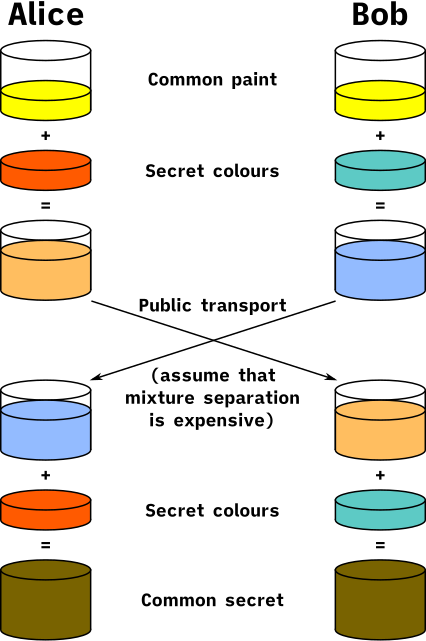
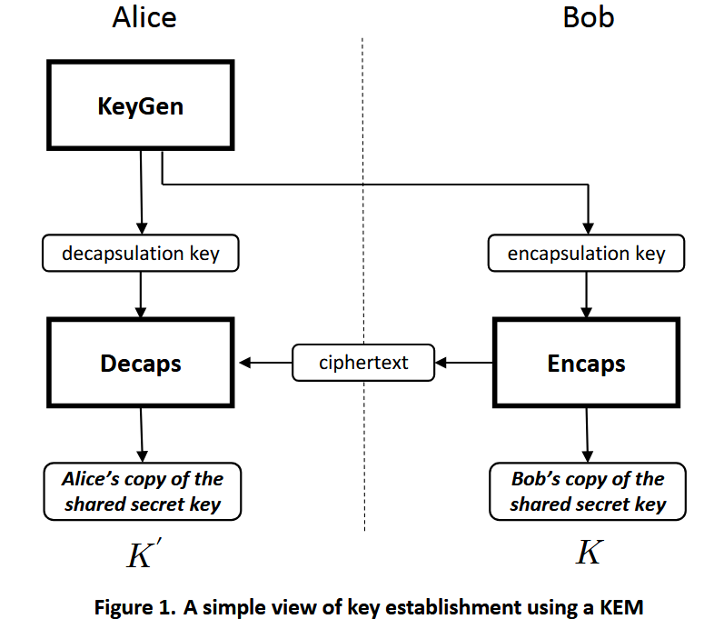

+++
title = "从零开始了解 TLS 1.3 系列笔记 (五) —— 实用密码学之「密钥交换, Diffie–Hellman 与后量子加密」"
date = "2025-09-16"
# updated = ""
description = "本文介绍了密钥交换的基本概念, 着重介绍了 TLS 1.3 中使用的 (EC)DH 密钥交换协议, 以及后量子加密参与的混合密钥交换方案."

[taxonomies]
tags = ["TLS", "Cryptography"]

[extra]
toc = true
katex = true
tldr = """
1. (EC)DH 可作为密钥交换协议, 允许双方在不安全的渠道上安全地交换共享密钥.
1. (EC)DHE 是对 (EC)DH 的改进, 本质是限制了共享密钥的使用周期, 即使某次会话的密钥泄露, 也不会影响到之前或之后的会话.
1. 量子计算机的出现对 (EC)DH 的密码学安全保证构成威胁, 需要考虑量子安全的密钥交换算法, 如 ML-KEM.
"""
+++

## 导语

在密码学中, [密钥建立 (key establishment)](http://cacr.uwaterloo.ca/hac/about/chap12.pdf), 或称**密钥交换** (key exchange, KE), 是一个过程或协议. 通过该过程或协议, 通信双方共享密钥.

1. 在**密钥协商**中, 双方都对密钥的生成做出贡献, 因此没有一方能单独决定最终的密钥.

   如 Diffie-Hellman 密钥交换协议 (DH), 或 ECDH (Elliptic-Curve DH, 椭圆曲线 DH).
1. 在**密钥传输**中, 一方生成密钥并将其传输给另一方.

   如 RSA 密钥交换过程, 一方通过私钥加密随机会话密钥, 并将其发送到另一方, 另一方使用相应公钥将其解密.

   由于此过程是静态的, 高度依赖 RSA 的安全性, 在 TLS 1.3 中已被弃用, 即便是 TLS 1.2 中也不推荐使用.

通过密码学设计, 密钥交换方案 (Key exchange schemes) 允许通信双方安全地交换加密密钥, 通常这个过程发生在加密通讯开始时, 例如在 TLS 握手阶段.

大体上, 密钥协商可以基于匿名(**无认证**)的密钥交换协议 (如 DH), 密码或预共享密钥 (pre-shared key, PSK), 数字证书或许多元素的组合. 某些通信协议仅建立并从头到尾使用同一个共享密钥, 而另一些通信协议随着时间的流逝不断更改共享密钥.

## Diffie-Hellman 密钥交换 (DHKE)

DHKE 是最早的公钥协议之一, 允许两个没有事先了解的当事方在不安全的渠道上安全地交换共享密钥. 请注意, DHKE 可以对抗嗅探攻击 (即直接读取数据包), 但无法对抗中间人攻击 MitM (无认证, 中间人可以冒充).

DHKE 的实现包括经典的基于离散对数的 DH, 和基于椭圆曲线的 ECDH.

### 从混合颜色解释

  

这是来自维基百科的一幅经典图片, 利用混合颜色来解释 DH 的工作原理:

1. Alice 和 Bob 公开同意使用黄色;
1. Alice 选择一个秘密的红色, 并将其与黄色混合, 得到橙色;
1. Bob 选择一个秘密的海洋绿色, 并将其与黄色混合, 得到浅天蓝色;
1. Alice 和 Bob 交换他们混合后的颜色, 我们依然假设混合颜色难以分离出原始颜色;
1. Alice 将 Bob 交换过来的浅天蓝色与她的秘密颜色混合, 得到黄褐色;
1. Bob 将 Alice 交换过来的橙色与他的秘密颜色混合, 也得到黄褐色;

到此, Alice 和 Bob 都得到了相同的颜色, 即共享密钥, 而中间人 Eve 只能看到黄色, 橙色和浅天蓝色, 无法计算出黄褐色.

### 经典 DH

对于传统基于离散对数的 DH, 其过程类似于前面的颜色混合解释.

首先介绍一点数学背景知识:

1. 模幂: 是指求 $g$ 的 $a$ 次幂模 $p$ 的值 $c$ 的过程, 记作 $c = g^a \mod p$, 其中 $p$ 是一个质数;
2. 离散对数, 即模幂的逆运算, 是指已知 $g$, $p$, $c$, 求 $a$ 的过程
3. 模幂运算律: $g^{ab} \mod p = {(g^a \mod p)}^b \mod p$

模幂过程计算非常快, 然而离散对数求解被认为在 $p$ 足够大的情况下是在现有计算能力下无法完成的, 此即**离散对数难题** (discrete logarithm problem, DLP). 经典的 DHKE 就是基于 DLP 设计的.

那么类似地就有 DHKE 的过程:

1. Alice 和 Bob 公开同意使用一个大质数 $p$ 和一个生成元 $g$ (通常 $g$ 是 2 或 5, 不需要很大), 在代码层面是写死的;
1. Alice 选择一个秘密整数 $a$, 并计算 $A = g^a \mod p$, 将 $A$ 发送给 Bob;
1. Bob 选择一个秘密整数 $b$, 并计算 $B = g^b \mod p$, 将 $B$ 发送给 Alice;
1. Alice 收到 $B$ 后, 计算共享密钥 $S_1 = B^a \mod p$;
1. Bob 收到 $A$ 后, 计算共享密钥 $S_2 = A^b \mod p$;

由模幂的运算律可以找到 $S_1 = S_2$, 即 Alice 和 Bob 都得到了相同的共享密钥 $S$; 而中间人获得 $A$ 和 $B$ 后, 只能通过离散对数求解 $a$ 或 $b$.

在最常见的 DHKE 实现中 (RFC 3526), 基数是 $g = 2$, 模数 $p$ 是一个 1536 到 8192 比特的大质数. 而整数 $A$ $B$ 通常会使用非常大的数字以防范暴力破解. 对于这种离散对数问题 (DLP), 目前还不存在有效的算法.

### ECDH

ECDH 应用椭圆曲线代替了 DH 中的模幂.

我们依然有运算律:

$$(a * G) * b = (b * G) * a$$

其中 $a, b$ 为常数, $G$ 为椭圆曲线上的某一点的坐标 $(x, y)$.

类似地有 ECDH 的过程:

1. Alice 和 Bob 公开同意使用一个椭圆曲线和基点 $G$;
1. Alice 生成一个随机的 ECC 密钥对: $A = a * G$, 将公钥 $A$ 发送给 Bob;
1. Bob 生成一个随机的 ECC 密钥对: $B = b * G$, 将公钥 $B$ 发送给 Alice;
1. Alice 收到 $B$ 后, 计算共享密钥 $S_1 = a * B$;
1. Bob 收到 $A$ 后, 计算共享密钥 $S_2 = b * A$

显然, $S_1 = S_2$, 即 Alice 和 Bob 都得到了相同的共享密钥 $S$, 而私钥 $a$, $b$ 的安全性, 则类似地由 ECDLP 问题提供保证, 即「通过公开的 $kG$ 以及 $G$ 这两个参数, 目前没有有效的手段能快速求解出 $k$ 的值. 」

#### 示例

> 如果读者还是对 (EC)DH 感到陌生, 相信 X25519 这个名字会更熟悉一些, 这是 TLS 1.3 中最常用的密钥交换算法.
>
> 以下内容参考自 [深入理解 X25519](https://crypto-in-action.github.io/intro-ed25519/190902-intro-x25519.pdf), 在此表示感谢.

Curve25519 是一种椭圆曲线, 由 Daniel J. Bernstein 在 2005 年设计, 其设计目标是提供高安全性和高性能的椭圆曲线密码学 (ECC) 操作. Curve25519 的名称来源于其使用的素数 $2^{255} - 19$, 该素数定义了曲线所在的有限域. 而 X25519 是基于 Curve25519 的密钥交换协议, 具体来说, X25519 是一种椭圆曲线 Diffie-Hellman (ECDH) 密钥交换协议的实现.

值得记忆的常识:

1. X25519 协议对应的私钥是 32 字节.
1. X25519 协议对应的公钥是 **32** 字节.

也有 secp256r1 (NIST P-256) / P-384 / P-521, 公钥会长一点, Chrome 未使用, Firefox 使用.

### DHE (Diffie-Hellman Ephemeral, 临时 DH)

前面介绍的经典 DH 与 ECDH 协议流程, 都是在最开始时交换一次密钥, 之后就一直使用该密钥通讯. 因此如果密钥被破解, 整个会话的所有信息对攻击者而言就完全透明了.

为了进一步提高安全性, 密码学家提出了「完全前向保密 (Perfect Forward Secrecy, PFS)」的概念, 并在 DHKE 与 ECDH 的基础上提出了支持 PFS 的 DHE / ECDHE 协议.

PFS 是指长期使用的主密钥泄漏不会导致过去的会话密钥泄漏, 从而保护过去进行的通讯不受密码或密钥在未来暴露的威胁.

DHE / ECDHE 协议的流程与前面介绍的 DH / ECDH 类似, 但每次通讯时都会重新生成一对密钥对, 计算出新的共享密钥随密文发送供下一轮使用. 这样即使某次会话的密钥被破解, 也不会影响到之前或之后的会话.

(~~一个小问题: 如果能破解一次, 那么破解下一次应该也不难了?~~)

### 量子计算机的影响

在量子计算机面前, DLP 可以通过 Shor 算法解决, 因此 DH 和 ECDH 在量子计算机面前不再安全. 值得庆幸的是, 当前量子计算机还远未达到能破解这些加密算法的规模, 但从长远来看, 我们需要考虑量子安全的密钥交换算法.

## 后量子密码学 (Post-Quantum Cryptography, PQC) 应用: 混合密钥交换 (Hybrid Key Exchange)

> 相信读者一定提到过 X25519MLKEM768, X25519Kyber768Draft00 这样的名字, 这是 TLS 1.3 中的混合密钥交换方案, 本节简要介绍.

前面提到, 量子计算机的出现对 (EC)DH 的密码学安全保证构成威胁, 因此需要考虑量子安全的密钥交换算法. 目前, NIST 在 [FIPS. 203](https://nvlpubs.nist.gov/nistpubs/FIPS/NIST.FIPS.203.pdf) 中标准化了 ML-KEM (Module-Lattice-Based Key-Encapsulation Mechanism, 基于模格的密钥封装机制), 各大厂商亦跟进用之替代了先前测试阶段的 Kyber (ML-KEM 的前身).

在介绍混合密钥交换之前, 先简要介绍一下 KEM.

### KEM (Key Encapsulation Mechanism, 密钥封装机制)

如其名, 密钥封装机制核心就是对密文的封装 (encapsulate) 与解封装 (decapsulate), 示意图如下:

  

主要流程为:

1. Alice 生成一对公私钥 $(pk, sk)$, 并将公钥 $pk$ 发送给 Bob; 公钥也称封装密钥 (encapsulation key), 私钥也称解封装密钥 (decapsulation key);
1. Bob 使用公钥 $pk$ 执行 Encaps 操作, 获得一个密钥和关联的**封装密文**; Bob 将关联密文发送给 Alice, 密钥则作为共享密钥使用;
1. Alice 使用私钥 $sk$ 对关联密文执行 Decaps 解封装操作, 获得共享密钥;

到此, Alice 和 Bob 得到了相同的共享密钥.

而 ML-KEM 是 KEM 中的一种, 其安全性基于模格 (Module-Lattice) 问题, 目前已知的量子计算机无法有效解决.

稍微跑题, 还有 ML-DSA, 作为数字签名算法 (DSA), 应用于 TLS 证书验证模块 (draft-ietf-tls-mldsa).

### TLS 1.3 中的混合密钥交换

(也许是)出于兼容性考虑, 目前 TLS 1.3 中的后量子密钥交换方案均以混合密钥交换的形式出现.

感谢 [@jschauma 总结的一图流](https://www.netmeister.org/blog/tls-hybrid-kex.html),  (图示为 X25519Kyber768, 但其他的基于 ML-KEM 的混合密钥交换方案也是类似的流程):

  

简单地来说, 就是在原 (EC)DH 的基础上, 额外增加了 KEM 的公钥交换与密文交换过程: 客户端将 PQC 公钥拼接在客户端向服务端共享的 (EC)DH 公钥后, 服务端将封装密文拼接在服务端向客户端共享的 (EC)DH 公钥后, 双方最终将通过 (EC)DH 得到的共享密钥与 KEM 拿到的或解封装出来的共享密钥拼接起来, 就得到了最终的共享密钥, 是不是非常简单粗暴呢.

> 碎碎念
>
> 后量子算法的引入, 直接导致 ClientHello 消息体积暴增, 如 X25519MLKEM768, 会额外多出 32 字节的用于回落的 X25519 公钥, 以及 1184 字节的 ML-KEM-768 的公钥, 加上原有的 500 字节左右, 大概是 1700 字节左右, 已经超过了 IPv4 TCP 最大 MSS (1500 - 20 - 20 = 1460 Bytes) 导致需要分包, 一旦丢包, 握手延迟蹭蹭涨.
>
> 

>  
> 

>
> 即便使用纯 PQC, 也只是堪堪减少 32 Bytes, 于事无补.

---

## 小结

读完本文, 我们应该已经熟悉以下术语及相应的流程:

- 密钥交换 (Key Exchange, KE)
- **密钥协商** (Key Agreement)
- 密钥传输 (Key Transport)
- Diffie-Hellman (**DH**)
- 椭圆曲线 Diffie-Hellman (**ECDH**)
  - Curve25519, **X25519**
  - secp256r1 (NIST **P-256**), etc.
- 临时 Diffie-Hellman (**DHE**)
- 完全前向保密 (Perfect Forward Secrecy, PFS)
- 后量子安全; 密钥封装机制 (Key Encapsulation Mechanism, KEM)
  - ML-KEM (Module-Lattice-based KEM)
- 混合密钥交换 (Hybrid Key Exchange)
