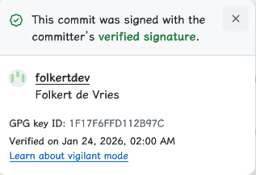
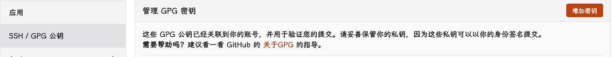

+++
title = "了解和使用 GPG"
date = "2026-02-01"
# updated = ""
description = "简要总结 GPG 基本概念、术语, GPG 密钥生成及管理相关内容, 以便快速参考."

[taxonomies]
tags = ["GPG"]

[extra]
toc = true
+++

## 前言

本文出现的所有命令的示例均在 Debian 13 上操作 GPG ([GnuPG]) 2.4.7 版本完成. 本文参考、借鉴、总结了大量资料, 在文末给出相关链接, 在此先表达感谢.

## 基本概念与术语

### 密码学基础

建议阅读 [『从零开始了解 TLS 1.3 系列笔记 (六) —— 实用密码学之「对称加密、AEAD 与非对称密码学」』](../25-09-17-tls-series-cryptography-5) 中的非对称密码学 (公钥密码学) 部分, [『从零开始了解 TLS 1.3 系列笔记 (五) —— 实用密码学之「密钥交换, Diffie–Hellman 与后量子加密」』](../25-09-16-tls-series-cryptography-4) 中的后量子密码学部分, 此处不再赘述.

应当了解:

1. 非对称密码学 (公钥密码学) 的基本概念;
1. RSA 和 ECC 公钥密码系统的基本概念, ECC 公钥密码系统中如 Curve25519 和 X25519 以及 Ed25519 的关系;
1. RSA 和 ECC 公钥密码系统的作用, 如数字签名等;
1. 常见的 EdDSA, 如基于 Curve25519 的 Ed25519, 基于 Curve448 的 Ed448;
1. 常见的 ECDSA, 如 NIST P-256 (secp256r1);
1. ECDSA 和 EdDSA 的区别.

### GPG

GPG ([GnuPG], GNU Privacy Guard) 是一款自由和开源软件 (FOSS), 通过对各类密码学原语的封装, 遵照 [OpenPGP] 标准, 实现了加密 (**E**crypt)、签名 (**S**ign) 和认证 (**A**uthenticating) 功能, 以及密钥管理功能 (**C**ertify). PGP 早期为一具备类似功能的闭源专有程序[^1], 虽然如今称呼 PGP 等价于称呼 OpenPGP 了.

[^1]: [WikiPedia: GNU Privacy Guard](https://en.wikipedia.org/wiki/GNU_Privacy_Guard).

GPG 生成并管理以下几种公私钥对:

1. 主密钥对

   包含主私钥 (sec) 和主公钥 (pub).

   虽然可以让主密钥对提供上述全部功能, 但一般不推荐那么做. 相反, 我们推荐仅授予主密钥对以密钥管理功能, 完成密钥准备工作后即离线保存主私钥, 仅在需要时加载, 包括但不限于:

   1. 添加或吊销子密钥;
   1. 添加、更改或吊销密钥关联身份 (UID);
   1. 添加或更改本身或其他子密钥的到期时间;
   1. 为了网络信任目的为其他密钥签名, 等.

   后文我们再继续介绍.

1. 子密钥对

   包含子私钥 (ssb) 和子公钥 (sub), 按前述用途可细分为 ssb S / A / E, sub S / A / E.

   我们推荐为不同用途分别生成子密钥对.

以下称 "主/子密钥" 时, 均指公钥和私钥的组合, 即密钥对.

## 安装 GPG

不再赘述, 现代 Linux 发行版一般默认安装, Windows 系统下可以安装 [Kleopatra], 会捎带着安装命令行版本的 GPG. 下面的示例均使用命令行操作.

## 准备 GPG 密钥

### 生成主密钥

执行 `gpg --full-gen-key --expert` 进行交互式生成.

#### 选择密钥类型

出于性能原因, 我们推荐选择 ECC 密钥类型, 除非需要兼容老设备等才选择 RSA. 虽然, ECC 和 RSA 一样并不具备后量子安全性, 但后量子安全的算法目前尚未成熟, OpenPGP 尚未跟进相关进展.

由于我们希望主密钥专用于管理子密钥, 即执行 Certify 的功能, 我们选择 "(11) ECC (set your own capabilities)", 然后手动设置主密钥功能 (初始时自带 `Sign` 和 `Certify` 的功能, 输入 `S` 关闭签名功能即可, 然后按 `Q` 保存).

```shellsession
Please select what kind of key you want:
   (1) RSA and RSA
   (2) DSA and Elgamal
   (3) DSA (sign only)
   (4) RSA (sign only)
   (7) DSA (set your own capabilities)
   (8) RSA (set your own capabilities)
   (9) ECC (sign and encrypt) *default*
  (10) ECC (sign only)
  (11) ECC (set your own capabilities)
  (13) Existing key
  (14) Existing key from card
Your selection? 11

Possible actions for this ECC key: Sign Certify Authenticate
Current allowed actions: Sign Certify

   (S) Toggle the sign capability
   (A) Toggle the authenticate capability
   (Q) Finished

Your selection? S

Possible actions for this ECC key: Sign Certify Authenticate
Current allowed actions: Certify

   (S) Toggle the sign capability
   (A) Toggle the authenticate capability
   (Q) Finished

Your selection? Q
```

#### 选择 ECC 曲线

出于兼容性原因, 我们选择 Curve25519 而不是 Curve448; 出于安全考虑[^2], 不推荐 NIST 系列曲线、Brainpool 系列曲线或 secp256k1.

[^2]: 参阅 <https://safecurves.cr.yp.to/>.

```shellsession
Please select which elliptic curve you want:
   (1) Curve 25519 *default*
   (2) Curve 448
   (3) NIST P-256
   (4) NIST P-384
   (5) NIST P-521
   (6) Brainpool P-256
   (7) Brainpool P-384
   (8) Brainpool P-512
   (9) secp256k1
Your selection? 1
```

#### 配置有效期

出于安全考虑, 不建议配置密钥永不过期. 此处我们设置为 4 年.

```shellsession
Please specify how long the key should be valid.
         0 = key does not expire
      <n>  = key expires in n days
      <n>w = key expires in n weeks
      <n>m = key expires in n months
      <n>y = key expires in n years
Key is valid for? (0) 4y
Key expires at Fri Feb  1 15:45:55 2030 CST
Is this correct? (y/N) y
```

#### 配置 UID

用户 ID 用于将密钥和真人关联, 同一个主密钥下可以有多个 UID 适应多个身份.

```shellsession
GnuPG needs to construct a user ID to identify your key.

Real name: Hantong Chen
Email address: public-service@7rs.net
Comment: 2026
You selected this USER-ID:
    "Hantong Chen (2026) <public-service@7rs.net>"

Change (N)ame, (C)omment, (E)mail or (O)kay/(Q)uit? O
```

额外说一句, 大部分情况下别真填自己的真名上去; 此外邮箱至少应该能够收邮件, 后面会用到; 公钥会包含电子邮件地址, 注意隐私和垃圾邮件问题.

#### 配置密码保护

输入密码, 按 Tab 移动到下一项, 再次输入密码, 按 Tab 移动到 `<OK>` 确认.

```shellsession
┌─────────────────────────────────────────────────────────────┐
│ Please enter the passphrase to                              │
│ protect your new key                                        │
│                                                             │
│ Passphrases match.                                          │
│                                                             │
│ Passphrase: _______________________________________________ │
│                                                             │
│ Repeat: ___________________________________________________ │
│ ┌─────────────────────────────────────────────────────────┐ │
│ │                                                         │ │
│ └─────────────────────────────────────────────────────────┘ │
│        <OK>                                   <Cancel>      │
└─────────────────────────────────────────────────────────────┘
```

注意不要超时, 输入完毕后等待完成即可:

```shellsession
We need to generate a lot of random bytes. It is a good idea to perform
some other action (type on the keyboard, move the mouse, utilize the
disks) during the prime generation; this gives the random number
generator a better chance to gain enough entropy.
We need to generate a lot of random bytes. It is a good idea to perform
some other action (type on the keyboard, move the mouse, utilize the
disks) during the prime generation; this gives the random number
generator a better chance to gain enough entropy.
```

#### 小结

现在, 我们的主密钥就已经生成完毕了:

```shellsession
gpg: revocation certificate stored as '/home/hantong/.gnupg/openpgp-revocs.d/6D5497B80A0F26FDCED00EFCF95DD10B4BFF68A2.rev'
public and secret key created and signed.

pub   ed25519 2026-02-02 [C] [expires: 2030-02-01]
      6D5497B80A0F26FDCED00EFCF95DD10B4BFF68A2
uid                      Hantong Chen (2026) <public-service@7rs.net>
```

请务必牢记密码, 后面所有用到私钥的地方都会要求输入密码.

可以使用 `gpg --list-keys --keyid-format long` 和 `gpg --list-secret-keys --keyid-format long` 列出所有公钥和私钥:

```shellsession
> gpg --list-keys --keyid-format long
# 略去部分输出
pub   ed25519/F95DD10B4BFF68A2 2026-02-02 [C] [expires: 2030-02-01]
      6D5497B80A0F26FDCED00EFCF95DD10B4BFF68A2
uid                 [ultimate] Hantong Chen (2026) <public-service@7rs.net>
```

```shellsession
> gpg --list-secret-keys --keyid-format long
# 略去部分输出
sec   ed25519/F95DD10B4BFF68A2 2026-02-02 [C] [expires: 2030-02-01]
      6D5497B80A0F26FDCED00EFCF95DD10B4BFF68A2
uid                 [ultimate] Hantong Chen (2026) <public-service@7rs.net>
```

可以看到:

1. 长 ID: `6D5497B80A0F26FDCED00EFCF95DD10B4BFF68A2`
1. 短 ID: `F95DD10B4BFF68A2`
1. 主密钥用途: "[C]"
1. 主密钥创建日期: "2026-02-02"
1. 主密钥有效期止: "2030-02-01"
1. UID: 信任状态 (完全信任, "ultimate"), Real Name ("Hantong Chen"), 备注 ("2026") 和电子邮件 ("public-service#7rs.net")

### 生成子密钥

PKI 体系有证书信任链的存在, GPG 的子密钥机制 (subkey) 承担了类似功能, 即仅当配置了信任主公钥, 才信任主密钥下的子密钥; 吊销主密钥则全部子密钥失去信任; 吊销单个子密钥不影响其他子密钥或主密钥.

我们建议并在前述步骤中配置主密钥仅承担签发的功能, 接下来需要添加子密钥分别承担签名/认证/加密的功能.

使用 `gpg --expert --edit-key <key-id>` 进入编辑模式, 下面是示例操作过程:

```shellsession
> gpg --expert --edit-key 6D5497B80A0F26FDCED00EFCF95DD10B4BFF68A2
gpg (GnuPG) 2.4.7; Copyright (C) 2024 g10 Code GmbH
This is free software: you are free to change and redistribute it.
There is NO WARRANTY, to the extent permitted by law.

Secret key is available.

sec  ed25519/F95DD10B4BFF68A2
     created: 2026-02-02  expires: 2030-02-01  usage: C
     trust: ultimate      validity: ultimate
[ultimate] (1). Hantong Chen (2026) <public-service@7rs.net>

gpg> addkey
Please select what kind of key you want:
   (3) DSA (sign only)
   (4) RSA (sign only)
   (5) Elgamal (encrypt only)
   (6) RSA (encrypt only)
   (7) DSA (set your own capabilities)
   (8) RSA (set your own capabilities)
  (10) ECC (sign only)
  (11) ECC (set your own capabilities)
  (12) ECC (encrypt only)
  (13) Existing key
  (14) Existing key from card
Your selection? 10
Please select which elliptic curve you want:
   (1) Curve 25519 *default*
   (2) Curve 448
   (3) NIST P-256
   (4) NIST P-384
   (5) NIST P-521
   (6) Brainpool P-256
   (7) Brainpool P-384
   (8) Brainpool P-512
   (9) secp256k1
Your selection? 1
Please specify how long the key should be valid.
         0 = key does not expire
      <n>  = key expires in n days
      <n>w = key expires in n weeks
      <n>m = key expires in n months
      <n>y = key expires in n years
Key is valid for? (0) 4y
Key expires at Fri Feb  1 16:22:25 2030 CST
Is this correct? (y/N) y
Really create? (y/N) y
We need to generate a lot of random bytes. It is a good idea to perform
some other action (type on the keyboard, move the mouse, utilize the
disks) during the prime generation; this gives the random number
generator a better chance to gain enough entropy.

sec  ed25519/F95DD10B4BFF68A2
     created: 2026-02-02  expires: 2030-02-01  usage: C
     trust: ultimate      validity: ultimate
ssb  ed25519/29774A85FD26125D
     created: 2026-02-02  expires: 2030-02-01  usage: S
[ultimate] (1). Hantong Chen (2026) <public-service@7rs.net>

gpg> addkey
Please select what kind of key you want:
   (3) DSA (sign only)
   (4) RSA (sign only)
   (5) Elgamal (encrypt only)
   (6) RSA (encrypt only)
   (7) DSA (set your own capabilities)
   (8) RSA (set your own capabilities)
  (10) ECC (sign only)
  (11) ECC (set your own capabilities)
  (12) ECC (encrypt only)
  (13) Existing key
  (14) Existing key from card
Your selection? 11

Possible actions for this ECC key: Sign Authenticate
Current allowed actions: Sign

   (S) Toggle the sign capability
   (A) Toggle the authenticate capability
   (Q) Finished

Your selection? S

Possible actions for this ECC key: Sign Authenticate
Current allowed actions:

   (S) Toggle the sign capability
   (A) Toggle the authenticate capability
   (Q) Finished

Your selection? A

Possible actions for this ECC key: Sign Authenticate
Current allowed actions: Authenticate

   (S) Toggle the sign capability
   (A) Toggle the authenticate capability
   (Q) Finished

Your selection? Q
Please select which elliptic curve you want:
   (1) Curve 25519 *default*
   (2) Curve 448
   (3) NIST P-256
   (4) NIST P-384
   (5) NIST P-521
   (6) Brainpool P-256
   (7) Brainpool P-384
   (8) Brainpool P-512
   (9) secp256k1
Your selection? `1
Invalid selection.
Your selection? 1
Please specify how long the key should be valid.
         0 = key does not expire
      <n>  = key expires in n days
      <n>w = key expires in n weeks
      <n>m = key expires in n months
      <n>y = key expires in n years
Key is valid for? (0) 4y
Key expires at Fri Feb  1 16:23:08 2030 CST
Is this correct? (y/N) y
Really create? (y/N) y
We need to generate a lot of random bytes. It is a good idea to perform
some other action (type on the keyboard, move the mouse, utilize the
disks) during the prime generation; this gives the random number
generator a better chance to gain enough entropy.

sec  ed25519/F95DD10B4BFF68A2
     created: 2026-02-02  expires: 2030-02-01  usage: C
     trust: ultimate      validity: ultimate
ssb  ed25519/29774A85FD26125D
     created: 2026-02-02  expires: 2030-02-01  usage: S
ssb  ed25519/11E7B3A29E772EB3
     created: 2026-02-02  expires: 2030-02-01  usage: A
[ultimate] (1). Hantong Chen (2026) <public-service@7rs.net>

gpg> addkey
Please select what kind of key you want:
   (3) DSA (sign only)
   (4) RSA (sign only)
   (5) Elgamal (encrypt only)
   (6) RSA (encrypt only)
   (7) DSA (set your own capabilities)
   (8) RSA (set your own capabilities)
  (10) ECC (sign only)
  (11) ECC (set your own capabilities)
  (12) ECC (encrypt only)
  (13) Existing key
  (14) Existing key from card
Your selection? 12
Please select which elliptic curve you want:
   (1) Curve 25519 *default*
   (2) Curve 448
   (3) NIST P-256
   (4) NIST P-384
   (5) NIST P-521
   (6) Brainpool P-256
   (7) Brainpool P-384
   (8) Brainpool P-512
   (9) secp256k1
Your selection? 1
Please specify how long the key should be valid.
         0 = key does not expire
      <n>  = key expires in n days
      <n>w = key expires in n weeks
      <n>m = key expires in n months
      <n>y = key expires in n years
Key is valid for? (0) 4y
Key expires at Fri Feb  1 16:23:27 2030 CST
Is this correct? (y/N) y
Really create? (y/N) y
We need to generate a lot of random bytes. It is a good idea to perform
some other action (type on the keyboard, move the mouse, utilize the
disks) during the prime generation; this gives the random number
generator a better chance to gain enough entropy.

sec  ed25519/F95DD10B4BFF68A2
     created: 2026-02-02  expires: 2030-02-01  usage: C
     trust: ultimate      validity: ultimate
ssb  ed25519/29774A85FD26125D
     created: 2026-02-02  expires: 2030-02-01  usage: S
ssb  ed25519/11E7B3A29E772EB3
     created: 2026-02-02  expires: 2030-02-01  usage: A
ssb  cv25519/AE4E4336187491D9
     created: 2026-02-02  expires: 2030-02-01  usage: E
[ultimate] (1). Hantong Chen (2026) <public-service@7rs.net>

gpg> save
```

常用的命令:

1. `addkey`: 添加子密钥

   ```shellsession
   gpg> addkey
   Please select what kind of key you want:
      (3) DSA (sign only)
      (4) RSA (sign only)
      (5) Elgamal (encrypt only)
      (6) RSA (encrypt only)
      (7) DSA (set your own capabilities)
      (8) RSA (set your own capabilities)
     (10) ECC (sign only)
     (11) ECC (set your own capabilities)
     (12) ECC (encrypt only)
     (13) Existing key
     (14) Existing key from card
   Your selection?
   ```

   子密钥的密钥类型并不要求和主密钥一致, 不过我们沿用 ECC.

   对于签名 (`S`) 用途, 我们选择 `ECC (sign only)`; 对于认证 (`A`) 用途, 我们选择 `ECC (set your own capabilities)`; 对于加密 (`E`) 用途, 我们选择 `ECC (encrypt only)`. 接下来的选择 ECC 曲线和配置密钥有效期和配置主密钥时的步骤一致.

   特别地, 认证 (`A`) 用途选择 `ECC (set your own capabilities)` 时, 类似配置主密钥的密钥用途那样, 一开始会让我们手动选择密钥用途:

   ```shellsession
   Possible actions for this ECC key: Sign Authenticate
   Current allowed actions: Sign

      (S) Toggle the sign capability
      (A) Toggle the authenticate capability
      (Q) Finished

   Your selection?
   ```

   这里默认情况下是签名用途的, 我们输入 `A` 添加认证用途, 再输入 `S` 去掉签名用途, 最后输入 `Q` 完成用途设置.
1. `key <key-id>`: 选中 `<key-id>` 指示的密钥.

   选中时, 密钥前会带有 `*` 号; 再次输入相同 ID 即为取消选中.
1. `delkey`: 删除子密钥

   需要提前选中子密钥.
1. `expire`: 更改密钥有效期.

   需要提前选中子密钥, 否则默认修改主密钥的有效期.
1. `save`: 保存并退出编辑模式.

   千万别忘记执行此命令, 否则前面的操作都白做了.

### 导出主密钥吊销证书

前面生成主密钥时, 还生成了一个吊销证书:

```shellsession
gpg: revocation certificate stored as '/home/hantong/.gnupg/openpgp-revocs.d/6D5497B80A0F26FDCED00EFCF95DD10B4BFF68A2.rev'
```

吊销证书是需要吊销主密钥但丢失主私钥时的兜底手段, 需要妥善保存.

### 导出公钥

执行 `gpg --output <pub-key-file> --armor --export <key-id>` 导出公钥, 例如:

```shellsession
> gpg --output 6D5497B80A0F26FDCED00EFCF95DD10B4BFF68A2.pub --armor --export 6D5497B80A0F26FDCED00EFCF95DD10B4BFF68A2
```

此即将 `6D5497B80A0F26FDCED00EFCF95DD10B4BFF68A2` 指示的 GPG 密钥的公钥以 ASCII 装甲格式 (`--armor`, 或者说 PEM 格式, 人类可读) 导出于当前文件夹的 `6D5497B80A0F26FDCED00EFCF95DD10B4BFF68A2.pub` 文件中.

GPG 导出的公钥**包含主公钥和全部的子公钥**, 以及有效期、子密钥吊销信息、UID 等必要信息, 并使用主私钥签名防止被篡改.

### 导出私钥

执行 `gpg --output <key-file> --armor --export-secret-keys <key-id>!` 导出主私钥, 例如:

```shellsession
> gpg --output 6D5497B80A0F26FDCED00EFCF95DD10B4BFF68A2.primary.key --armor --export-secret-keys 6D5497B80A0F26FDCED00EFCF95DD10B4BFF68A2!
```

此即将 `6D5497B80A0F26FDCED00EFCF95DD10B4BFF68A2` 指示的 GPG 密钥的**主私钥**以 ASCII 装甲格式导出于当前文件夹的 `6D5497B80A0F26FDCED00EFCF95DD10B4BFF68A2.primary.key` 文件中. 注意, 这里的 `!` 是必须的.

执行 `gpg --output <key-file> --armor --export-secret-subkeys <key-id>` 导出子私钥, 例如:

```shellsession
> gpg --output 6D5497B80A0F26FDCED00EFCF95DD10B4BFF68A2.sub.key --armor --export-secret-subkeys 6D5497B80A0F26FDCED00EFCF95DD10B4BFF68A2
```

此即将 `6D5497B80A0F26FDCED00EFCF95DD10B4BFF68A2` 指示的 GPG 密钥的**全部子私钥**以 ASCII 装甲格式导出于当前文件夹的 `6D5497B80A0F26FDCED00EFCF95DD10B4BFF68A2.sub.key` 文件中.

随后离线保存主私钥, 以及备份子私钥, 以转移至其他机器上使用.

### 删除本机密钥

在导出密钥后, 我们执行 `gpg --delete-secret-keys <key-id>` 执行交互式删除私钥, 如:

```shellsession
> gpg --delete-secret-keys 6D5497B80A0F26FDCED00EFCF95DD10B4BFF68A2
```

如果需要在当前机器上使用子密钥, 则只需要删除主私钥, 提示删除子私钥时取消即可. 操作完成后如果你尝试列出私钥, 会发现主私钥已经被移除了 (提示 `sec#`), 仅剩子私钥, 如:

```shellsession
> gpg --list-secret-keys --keyid-format long
# 略去部分输出
sec#  ed25519/F95DD10B4BFF68A2 2026-02-02 [C] [expires: 2030-02-01]
      6D5497B80A0F26FDCED00EFCF95DD10B4BFF68A2
uid                 [ultimate] Hantong Chen (2026) <public-service@7rs.net>
ssb   ed25519/29774A85FD26125D 2026-02-02 [S] [expires: 2030-02-01]
ssb   ed25519/11E7B3A29E772EB3 2026-02-02 [A] [expires: 2030-02-01]
ssb   cv25519/AE4E4336187491D9 2026-02-02 [E] [expires: 2030-02-01]
```

如果打算在当前机器上彻底删除, 则一路确认删除主私钥和子私钥后, 执行 `gpg --delete-keys <key-id>` 删除公钥, 如:

```shellsession
> gpg --delete-keys 6D5497B80A0F26FDCED00EFCF95DD10B4BFF68A2
```

### 小结

到这里, 我们已经完成了 GPG 密钥生成的全部操作, 没有特殊情况, 可以直接移步应用章节了.

## 公布 GPG 公钥

虽然 GPG 采用点对点的信任体系, 没有 PKI 那样的中心化信任机构, 但为了便利起见, 我们仍然可以将公钥上传到公钥服务器 (Key Server), 以便对等方方便获取和信任该公钥.

需要注意, 上传公钥到公钥服务器**存在风险**. 首先, 这是不可逆的操作, 一旦上传, 即使后续吊销该密钥, 该密钥仍然可以被下载和使用; 此外, 公钥服务器一般不会删除已经上传的公钥, 即使该公钥已经吊销. 更详细的风险说明参阅 [『2021 年，用更现代的方法使用PGP（下） - 安全风险和争议， 被玩坏的KeyServer』](https://ulyc.github.io/2021/01/26/2021%E5%B9%B4-%E7%94%A8%E6%9B%B4%E7%8E%B0%E4%BB%A3%E7%9A%84%E6%96%B9%E6%B3%95%E4%BD%BF%E7%94%A8PGP-%E4%B8%8B/#%E5%AE%89%E5%85%A8%E9%A3%8E%E9%99%A9%E5%92%8C%E4%BA%89%E8%AE%AE-%E8%A2%AB%E7%8E%A9%E5%9D%8F%E7%9A%84keyserver). 除非你非常确定需要上传公钥, 否则不建议上传公钥到公钥服务器.

上传公钥到公钥服务器的命令如下:

```shellsession
> gpg --keyserver hkps://keys.openpgp.org --send-keys 6D5497B80A0F26FDCED00EFCF95DD10B4BFF68A2
```

## 吊销 GPG 密钥

如果一个主/子密钥或者 UID 不再使用了, 将其删除是没有意义的, 因为我们已经将公钥分发给了对等方, 他们仍然会信任该密钥; 此外, 如果私钥泄露, 删除密钥并不能阻止他人继续使用该密钥. 为此, 我们需要吊销该密钥或 UID, 以告知对等方该密钥或 UID 不再可信, 方式包括:

1. 使用前面导出的吊销证书文件吊销主密钥:

   ```sh
   gpg --import <path-to-revocation-certificate-file>
   ```

1. 使用主私钥吊销密钥:

   ```sh
   gpg --edit-key <key-id>
   ```

   在交互式界面中按前面所述选中需要吊销的子密钥, 输入 `revkey` 吊销; 不选中任何子密钥时即吊销主密钥.

完成吊销后, 重新导出公钥并分发给对等方即可宣告吊销状态; 如果上传了公钥到公钥服务器, 也需要重新上传吊销后的公钥. 密钥吊销是不可逆的操作, 请谨慎执行.

## GPG 应用

下文示例仍然使用前面生成的 GPG 密钥, 信息再次指出如下:

1. 签名用途子密钥 ID: `29774A85FD26125D`
1. 认证用途子密钥 ID: `11E7B3A29E772EB3`
1. 加密用途子密钥 ID: `AE4E4336187491D9`

### Git commit 签名

下面是一个简单例子说明如何使用 GPG 签名 Git commit.

```shellsession
> export GPG_TTY=$(tty)
> cd /tmp
> git init ./test-gpg
> cd test-gpg
> echo "Hello, GPG!" > README.md
> git add *
> git commit -S29774A85FD26125D -m "Initial commit with GPG signature"
```

输入 GPG 密钥密码后, 即可完成签名提交:

```shellsession
> git log --show-signature
commit 745048eeb6e87f27d5e5a8aa1f6e33f3543b8942 (HEAD -> main)
gpg: Signature made Mon Feb  2 17:09:22 2026 CST
gpg:                using EDDSA key 652C18ED73F115A6F9369B9029774A85FD26125D
gpg: Good signature from "Hantong Chen (2026) <public-service@7rs.net>" [ultimate]
Author: Hantong Chen <public-service@7rs.net>
Date:   Mon Feb 2 17:09:22 2026 +0800

    Initial commit with GPG signature
```

可以修改 `~/.gitconfig` 配置文件, 以便每次提交时自动使用指定的 GPG 密钥签名, 如:

```ini
[user]
name = Hantong Chen
email = public-service@7rs.net
signingkey = 29774A85FD26125D
```

显然, 我们使用的是具备签名 (**S**) 用途的子密钥 ID, 后面不再赘述.

#### Github GPG 配置

打开 [Add new GPG key](https://github.com/settings/gpg/new) 页面, 填写 Title, 将前面导出的公钥文件内容全部复制粘贴至 Key 的文本框中确认即可. 添加完毕的效果如下图所示:


完成添加后, 如果邮箱还没有在 Github 上添加 (图中可见 Email address 是 Unverified 的) 就去添加一下即可, 和本文无关, 此处不赘述.

一切配置正确后, 带有签名的 commit 即会显示为 Verified (此处随意截取了一个 commit, 非本文生成的 commit):



可以配置 `Vigilant mode`:


上述流程可能存在时效性, 以官方文档 [GitHub Docs: Adding a GPG key to your GitHub account](https://docs.github.com/en/authentication/managing-commit-signature-verification/adding-a-gpg-key-to-your-github-account) 说明的最新流程为准.

#### Gitea / Forgejo GPG 配置

打开 <https://{YOUR_GIT_SERVER_HOST}/user/settings/keys>, 添加 GPG 密钥:



如果 GPG 密钥的电子邮件和当前用户一致电子邮件不匹配, 则会要求执行一次签名确认:

```shellsession
> echo "[REDACTED]" | gpg -a --default-key F95DD10B4BFF68A2 --detach-sig
gpg: using "F95DD10B4BFF68A2" as default secret key for signing
-----BEGIN PGP SIGNATURE-----

[REDACTED]
-----END PGP SIGNATURE-----
```

将执行结果 ("`-----BEGIN PGP SIGNATURE-----`" 和 "`-----END PGP SIGNATURE-----`" 之间的部分, 包括这两行) 复制粘贴至确认框中完成确认.

#### 疑难杂症

1. "gpg: signing failed: Inappropriate ioctl for device"

   出现该错误时, 一般是因为 `GPG_TTY` 环境变量未正确设置.

    解决方案: 需要执行 `export GPG_TTY=$(tty)`, 或者添加至 `~/.bashrc` 等 shell 配置文件中.

1. "not a tty"

   使用 zsh 时, 在 VSCode 远程开发等场景中, 将 `export GPG_TTY=$(tty)` 添加至 `~/.zshrc`, 可能出现 "not a tty" 错误.

   解决方案: 需要在 `~/.zshenv` 中添加而不是 `~/.zshrc`.

1. 其他奇奇怪怪无法弹出 GPG 密码输入窗口的问题.

   解决方案: 建议重新打开终端再尝试一下.

### 文件加解密

```sh
gpg [--output <output-file>] --encrypt --recipient <recipient-key-id> <input-file>
```

即: 使用 `<recipient-key-id>` 密钥对的公钥加密 `<input-file>` 文件, 输出加密结果至 `<output-file>`, 如果未指定 `--output <output-file>`, 默认输出至 `<input-file>.gpg`.

```sh
gpg --output <decrypted-file> --decrypt <encrypted-file>
```

即: 使用和加密时使用的公钥成对的私钥解密 `<encrypted-file>` 文件, 输出解密结果至 `<decrypted-file>`.

一个例子:

```shellsession
> cd /tmp
> echo "Hello, GPG file encryption" > secret.test
> gpg --output secret.test.gpg --encrypt --recipient AE4E4336187491D9 secret.test
# 提示输入密码时输入密码; 短时间内重复加密不会再提示输入密码
> gpg --output secret.decrypted.test --decrypt secret.test.gpg
gpg: encrypted with cv25519 key, ID AE4E4336187491D9, created 2026-02-02
      "Hantong Chen (2026) <public-service@7rs.net>"
> cat secret.decrypted.test
Hello, GPG file encryption
```

### 签名和验签

```sh
gpg --armor [-u <your-key-id>] --output <output-sig-file> --detach-sign <file-to-be-signed>
```

即: 使用 `<your-key-id>` 密钥对的私钥 (不提供则使用 GPG 配置的默认密钥) 签名 `<file-to-be-signed>` 文件, 生成 PEM 格式的签名 (`--armor`, `-a`) 并保存至 `<output-sig-file>` 而不是嵌入待签名的文件内 (`--detach-sign`).

```sh
gpg [-u <your-key-id>] --verify <sig-file> <file-to-be-verified>
```

即: 使用 `<your-key-id>` 密钥对的公钥 (不提供则自动匹配), 对 `<file-to-be-verified>` 文件, 读取并验证 `<sig-file>` 中的签名, 如果签名有效且文件未被篡改, 则输出 "Good signature" 信息.

一个例子:

```shellsession
> cd /tmp
> echo "Hello, GPG signing" > signing.test
> gpg --armor -u 29774A85FD26125D --output signing.test.sig --detach-sign signing.test
> gpg --verify signing.test.sig signing.test
gpg: Signature made Mon Feb  2 23:01:40 2026 CST
gpg:                using EDDSA key 652C18ED73F115A6F9369B9029774A85FD26125D
gpg: Good signature from "Hantong Chen (2026) <public-service@7rs.net>" [ultimate]
```

这是相当常见的用途, 例如 Debian 软件包管理系统就使用 GPG 对软件包进行签名, 在早期 HTTPS 并不成熟时用以保证软件包在网络传输时不被篡改:

```shellsession
> cat /etc/apt/sources.list.d/debian.sources
Types: deb deb-src
URIs: http://deb.debian.org/debian
Suites: trixie trixie-updates trixie-backports
Components: main contrib non-free non-free-firmware
Signed-By: /usr/share/keyrings/debian-archive-keyring.gpg

Types: deb deb-src
URIs: http://deb.debian.org/debian-security
Suites: trixie-security
Components: main contrib non-free non-free-firmware
Signed-By: /usr/share/keyrings/debian-archive-keyring.gpg
> gpg --show-keys /usr/share/keyrings/debian-archive-keyring.gpg
pub   rsa4096 2021-01-17 [SC] [expires: 2029-01-15]
      1F89983E0081FDE018F3CC9673A4F27B8DD47936
      Revocable by: 80E976F14A508A48E9CA3FE9BC372252CA1CF964
      Revocable by: FBFABDB541B5DC955BD9BA6EDB16CF5BB12525C4
      Revocable by: 8C823DED10AA8041639E12105ACE8D6E0C14A470
      Revocable by: 309911BEA966D0613053045711B4E5FF15B0FD82
      Revocable by: C74F6AC9E933B3067F52F33FA459EC6715B0705F
uid                      Debian Archive Automatic Signing Key (11/bullseye) <ftpmaster@debian.org>
sub   rsa4096 2021-01-17 [S] [expires: 2029-01-15]

pub   rsa4096 2021-01-17 [SC] [expires: 2029-01-15]
      AC530D520F2F3269F5E98313A48449044AAD5C5D
      Revocable by: 80E976F14A508A48E9CA3FE9BC372252CA1CF964
      Revocable by: FBFABDB541B5DC955BD9BA6EDB16CF5BB12525C4
      Revocable by: 8C823DED10AA8041639E12105ACE8D6E0C14A470
      Revocable by: 309911BEA966D0613053045711B4E5FF15B0FD82
      Revocable by: C74F6AC9E933B3067F52F33FA459EC6715B0705F
uid                      Debian Security Archive Automatic Signing Key (11/bullseye) <ftpmaster@debian.org>
sub   rsa4096 2021-01-17 [S] [expires: 2029-01-15]
# 其余输出省略
```

可以看到, 该公钥文件包含了多个主密钥, 每个主密钥下有一个签名用途的子密钥.

(碎碎念: 本文的写作动机之一就是笔者想自行维护一个 APT 软件源, 对官方源不包含的一些较新的开源软件使用 Github Actions 执行可信自动构建并打包为 deb 包...)

## 结语

(唉, 年纪大了, 先总结到这里, 假装有个结语吧; 后面看情况增删补改.)

## 参考资料

本文参考了大量资料, 在此不完整列出, 以表感谢:

1. [简明 GPG 概念](https://zhuanlan.zhihu.com/p/137801979)
1. [使用 GPG](https://www.rectcircle.cn/posts/understand-and-use-gpg/)
1. [val's Blog - GPG 使用指南](https://gaoweix.com/gpg-guide/)
1. [GPG配置、命令、实例与apt-key密钥测试](https://www.cnblogs.com/usmile/p/12873604.html)
1. [An abridged guide to using ed25519 PGP keys with GnuPG and SSH](https://musigma.blog/2021/05/09/gpg-ssh-ed25519.html)
1. [GPG 筆記 - 產生 ECC 金鑰及加解密檔案](https://blog.darkthread.net/blog/gpg-gen-key-n-encrypt/)
1. ...

---

[GnuPG]: https://www.gnupg.org/
[OpenPGP]: https://www.openpgp.org/
[Kleopatra]: https://www.openpgp.org/software/kleopatra/
